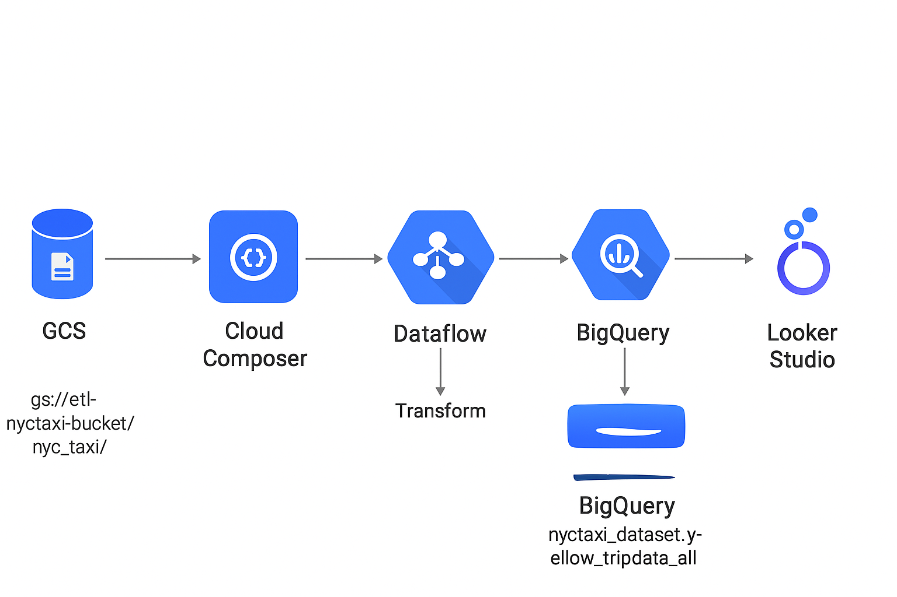
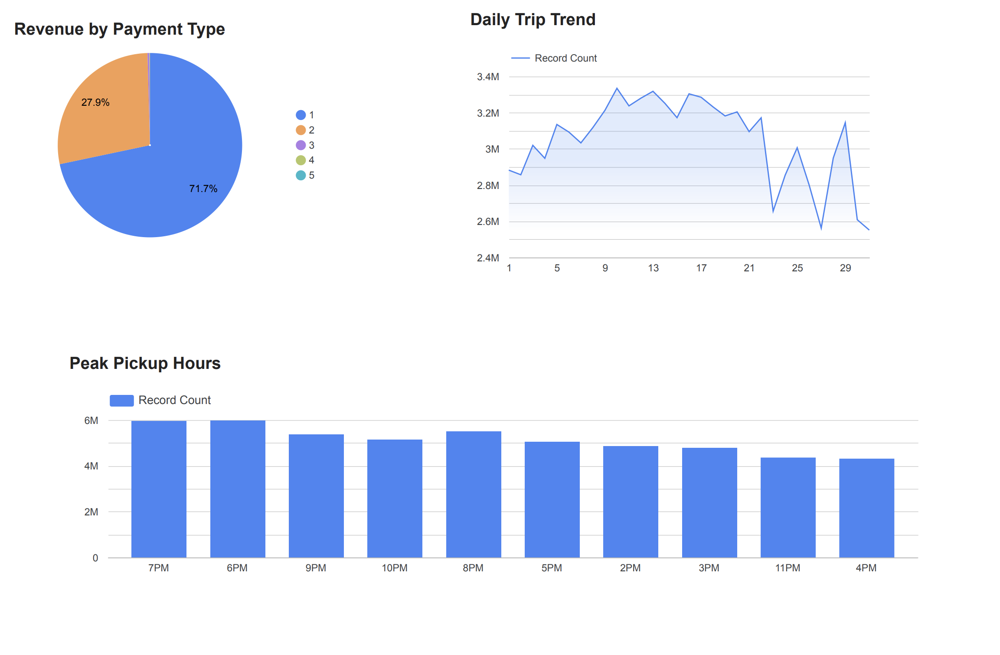

# NYC Taxi Data Engineering Pipeline – GCP End-to-End Project

This project demonstrates a fully automated, production-style ETL data pipeline built on Google Cloud Platform (GCP) using real-world NYC Yellow Taxi data.
It covers ingestion, transformation, storage, and visualization — showcasing practical Data Engineering skills and cloud-native tools.

# 🚀 Architecture Overview

Tech Stack:

Cloud Composer (Airflow) – Orchestration

Cloud Storage (GCS) – Raw & processed data storage

Dataflow (Apache Beam) – Distributed data transformation

BigQuery – Data warehouse

Looker Studio – Reporting & Dashboards

# 📦 Dataset

Source: NYC Yellow Taxi Dataset from Kaggle
https://www.kaggle.com/datasets/elemento/nyc-yellow-taxi-trip-data
Format: CSV

# ⚙️ Airflow Pipeline (Cloud Composer)

The Airflow DAG performs the following:

Checks raw files in GCS

Triggers Dataflow job using BashOperator

Dataflow reads raw CSV

Transforms and cleans data

Writes:

Parquet files → GCS

Final cleaned table → BigQuery

DAG: nyc_taxi_etl_dag.py

Code:

from airflow import DAG
from airflow.operators.bash import BashOperator
from datetime import datetime, timedelta

default_args = {
    'owner': 'airflow',
    'depends_on_past': False,
    'retries': 1,
    'retry_delay': timedelta(minutes=5),
}

with DAG(
    'nyc_taxi_etl_dag',
    default_args=default_args,
    description='ETL from GCS CSVs to BigQuery via Dataflow',
    schedule_interval='@daily',
    start_date=datetime(2025, 10, 27),
    catchup=False,
    max_active_runs=1
) as dag:

    run_dataflow = BashOperator(
        task_id='run_dataflow',
        bash_command=(
            "python3 /home/airflow/gcs/dags/dataflow_etl.py "
            "--runner=DataflowRunner "
            "--project=etl-demo-pipeline "
            "--region=us-central1 "
            "--temp_location=gs://etl-nyctaxi-bucket/temp/ "
            "--input=gs://etl-nyctaxi-bucket/nyc_taxi/*.csv "
            "--output_table=etl-demo-pipeline:nyctaxi_dataset.yellow_tripdata_all "
        )
    )

    run_dataflow

# 🛠️ Dataflow (Apache Beam) Transformations

The TransformRow DoFn:

Parses CSV rows

Handles type conversions (int, float, datetime)

Removes malformed records

Normalizes fields

Outputs:

Parquet (snappy-compressed)

BigQuery table: nyctaxi_dataset.yellow_tripdata_all

Code:

import apache_beam as beam
from apache_beam.options.pipeline_options import PipelineOptions
import csv
from datetime import datetime
import os
import pyarrow as pa
import logging

# --------------------------
# Transform Function
# --------------------------
class TransformRow(beam.DoFn):
    def __init__(self):
        # Counter for debugging skipped rows
        self.bad_rows = beam.metrics.Metrics.counter(self.__class__, "bad_rows")
        self.good_rows = beam.metrics.Metrics.counter(self.__class__, "good_rows")

    def process(self, row):
        values = next(csv.reader([row]))

        def safe_int(x):
            try:
                return int(x)
            except:
                return None

        def safe_float(x):
            try:
                return float(x)
            except:
                return None

        try:
            record = {
                'VendorID': safe_int(values[0]),
                'tpep_pickup_datetime': values[1],
                'tpep_dropoff_datetime': values[2],
                'passenger_count': safe_int(values[3]),
                'trip_distance': safe_float(values[4]),
                'RatecodeID': safe_int(values[5]),
                'store_and_fwd_flag': values[6],
                'pickup_longitude': safe_float(values[7]),
                'pickup_latitude': safe_float(values[8]),
                'dropoff_longitude': safe_float(values[9]),
                'dropoff_latitude': safe_float(values[10]),
                'payment_type': safe_int(values[11]),
                'fare_amount': safe_float(values[12]),
                'extra': safe_float(values[13]),
                'mta_tax': safe_float(values[14]),
                'tip_amount': safe_float(values[15]),
                'tolls_amount': safe_float(values[16]),
                'improvement_surcharge': safe_float(values[17]),
                'total_amount': safe_float(values[18]),
            }
            self.good_rows.inc()
            yield record

        except Exception as e:
            logging.warning(f"Skipping bad row: {row} | Error: {e}")
            self.bad_rows.inc()

# --------------------------
# Main Pipeline
# --------------------------
def run():
    import argparse
    parser = argparse.ArgumentParser()
    parser.add_argument('--input', required=False, default='gs://etl-nyctaxi-bucket/nyc_taxi/*.csv')
    parser.add_argument('--parquet_output', required=False, default='gs://etl-nyctaxi-bucket/output/nyc_taxi_parquet/')
    parser.add_argument('--output_table', required=False, default='etl-demo-pipeline:nyctaxi_dataset.yellow_tripdata_all')
    args, beam_args = parser.parse_known_args()

    options = PipelineOptions(beam_args, save_main_session=True)

    # Define Parquet schema
    parquet_schema = pa.schema([
        ('VendorID', pa.int64()),
        ('tpep_pickup_datetime', pa.string()),
        ('tpep_dropoff_datetime', pa.string()),
        ('passenger_count', pa.int64()),
        ('trip_distance', pa.float64()),
        ('RatecodeID', pa.int64()),
        ('store_and_fwd_flag', pa.string()),
        ('pickup_longitude', pa.float64()),
        ('pickup_latitude', pa.float64()),
        ('dropoff_longitude', pa.float64()),
        ('dropoff_latitude', pa.float64()),
        ('payment_type', pa.int64()),
        ('fare_amount', pa.float64()),
        ('extra', pa.float64()),
        ('mta_tax', pa.float64()),
        ('tip_amount', pa.float64()),
        ('tolls_amount', pa.float64()),
        ('improvement_surcharge', pa.float64()),
        ('total_amount', pa.float64()),
    ])

    with beam.Pipeline(options=options) as p:
        # Step 1: Read and transform
        transformed = (
            p
            | 'ReadCSV' >> beam.io.ReadFromText(args.input, skip_header_lines=1)
            | 'Transform' >> beam.ParDo(TransformRow())
        )

        #Optional: Print sample output for debugging (disable in production)
        transformed | 'DebugPrint' >> beam.Map(print)

        # Step 2: Write to Parquet
        (
            transformed
            | 'WriteParquet' >> beam.io.WriteToParquet(
                file_path_prefix=os.path.join(args.parquet_output, 'nyc_taxi'),
                schema=parquet_schema,
                file_name_suffix='.parquet',
                codec='SNAPPY'
            )
        )

        # Step 3: Write to BigQuery
        (
            transformed
            | 'WriteToBigQuery' >> beam.io.WriteToBigQuery(
                args.output_table,
                schema='SCHEMA_AUTODETECT',
                write_disposition=beam.io.BigQueryDisposition.WRITE_APPEND,
                create_disposition=beam.io.BigQueryDisposition.CREATE_IF_NEEDED
            )
        )

if __name__ == '__main__':
    logging.getLogger().setLevel(logging.INFO)
    run()

# 🗄️ BigQuery Schema

Schema is auto-detected by Beam (SCHEMA_AUTODETECT) for:

Vendor details

Trip times

Geo coordinates

Fare components

# 📊 Looker Studio Dashboard

Dashboard includes the following insights:

## 1️⃣ Revenue by Payment Type

This visualization breaks down total revenue generated across the NYC Taxi dataset by each payment method (Credit Card, Cash, No Charge, etc.).
It helps identify:

Which payment types contribute the highest revenue

Customer preferences across different ride segments

Trends that can guide financial forecasting and operational decisions

Key Insight:
Credit card payments consistently account for the majority of ride revenue, indicating high adoption of digital payments and providing a more reliable revenue channel.

## 2️⃣ Daily Trip Trend

This line chart tracks the number of taxi trips per day over the analysis period.

It helps evaluate:

Daily fluctuations in demand

Patterns influenced by weekdays, weekends, or special events

Long-term ridership trends

Key Insight:
Daily trip counts show noticeable peaks around weekdays, with slight dips on weekends—reflecting typical commuter traffic behavior in NYC.

## 3️⃣ Peak Pickup Hours

This bar chart identifies the hours of the day when most pickups occur.

This analysis is essential for:

Understanding peak operational demand

Optimizing driver availability

Planning surge pricing or promotions

Resource allocation for transportation authorities

Key Insight:
Pickup activity peaks typically during evening (6–7 PM) rush hours, highlighting classic commuter travel patterns.

# 🌟 Key Learnings

How to orchestrate pipelines with Airflow and Google Cloud Composer

Using Apache Beam for parallel transformations

Writing Parquet + BigQuery from Beam

Handling schema inference

Building cloud-native end-to-end pipelines

Modern data modeling and dashboarding

# 🙋‍♀️ About

This project was built as part of my continuous learning in Data Engineering and GCP cloud technologies.